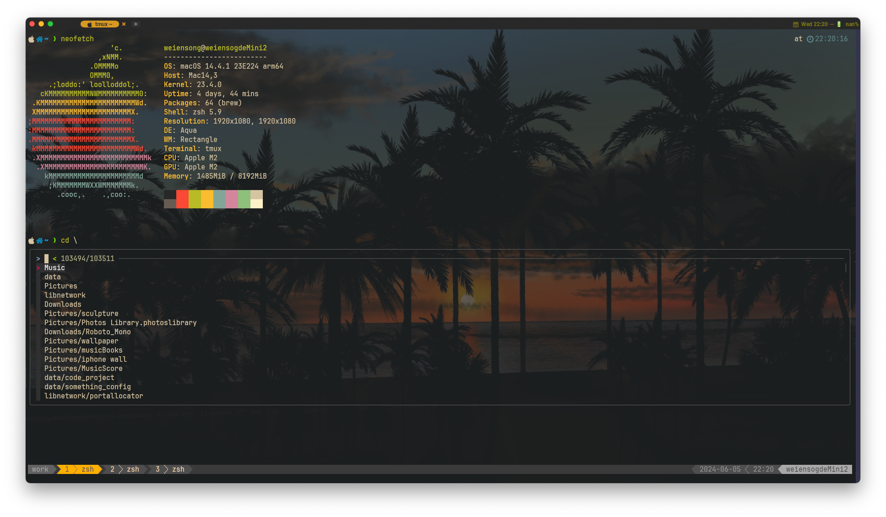

# My WezTerm config

## preview
 
 

## Usege
```shell
git clone https://github.com/touero/wezterm ~/.config/wezterm
```
If you think this configuration is more complicated, you can use `old/wezterm.lua`, which is my original configuration.


## Related Links

- <https://github.com/rxi/lume>
- <https://github.com/catppuccin/wezterm>
- <https://github.com/wez/wezterm/discussions/628#discussioncomment-1874614>
- <https://github.com/wez/wezterm/discussions/628#discussioncomment-5942139>
- <https://github.com/wez/wezterm/discussions/628#discussioncomment-3649195>


## Original author's repo
- <https://github.com/QianSong1/wezterm-config>
- <https://github.com/KevinSilvester/wezterm-config>


